<div align="center">
  


### This isn't just documentation. This is a battle log from the trenches of intensive learning.

[](https://your-github-username.github.io/iti-data-engineering-journey)
[](https://github.com/your-username/iti-data-engineering-journey)

</div>

---

## WHAT YOU'RE LOOKING AT

This repository will chronicle every session, every lab, every task from ITI's Data Engineering Intensive Code Camp. 6 months. No filler. Just pure technical grind documented in real-time.

**The Journey:** 500+ hours compressed into 6 major zones  
**The Goal:** Transform from beginner to production-ready data engineer  
**The Result:** You're looking at it

---

## THE BREAKDOWN

### `01_fundamentals/` — 25%
Where everything starts. You can't build pipelines if you can't write a loop.

```
├── python/          # From hello world to list comprehensions
├── linux/           # Bash, vim, and why sudo feels powerful  
└── databases/       # SQL fundamentals and relational thinking
```

**Core Skills:** Python mastery, Linux navigation, Database design

---

### `02_data_dimension/` — 32%
This is where data stops being abstract and becomes something you can actually manipulate.

```
├── pandas_numpy/         # Data wrangling on steroids
├── nosql/                # Document stores and flexible schemas
├── big_data/             # Hadoop, Spark, distributed computing
├── warehousing/          # Star schemas and dimensional modeling
└── visualization/        # Making executives say "wow"
```

**Core Skills:** Data analysis, NoSQL databases, Big Data fundamentals, Warehousing architecture

---

### `03_automation/` — 20%
Why do today what can run automatically tomorrow?

```
├── processing_frameworks/    # Spark and distributed processing
├── scheduling/                # Airflow DAGs and cron jobs
└── cicd/                      # Jenkins, Git workflows, deployment
```

**Core Skills:** Workflow orchestration, Pipeline automation, DevOps basics

---

### `04_cloud/` — 5%
Your infrastructure lives in the sky now.

```
└── aws/              # S3, EC2, Lambda, and the cloud ecosystem
```

**Core Skills:** Cloud services, AWS fundamentals, Serverless architecture

---

### `05_workshops/` — 7%
The "side quests" that actually matter in production.

```
├── agile/            # Scrum, sprints, and actually shipping
├── testing/          # Bug hunting and test coverage
├── os_fundamentals/  # How computers actually work
└── networking/       # TCP/IP, DNS, and packet flows
```

**Core Skills:** Agile methodology, Testing practices, System architecture, Network protocols

---

### `06_soft_skills/` — 11%
Technical chops get you interviews. These get you hired.

```
├── freelancing/      # Client work and rate negotiation
├── presentations/    # Talking to humans about technical things
├── communication/    # Emails that don't make people cringe
└── interviewing/     # Getting past the gatekeepers
```

**Core Skills:** Professional communication, Client management, Interview preparation

---

## TECH STACK MASTERED

**Languages & Frameworks**
- Python (Pandas, NumPy, Matplotlib)
- SQL (PostgreSQL, MySQL)
- NoSQL (MongoDB, Cassandra)
- Apache Spark
- Apache Airflow

**Infrastructure & Cloud**
- Linux (Ubuntu, CentOS)
- AWS (S3, EC2, Lambda)
- Docker
- Git & GitHub

**Data Engineering Tools**
- Data warehousing (Dimensional modeling)
- ETL pipelines
- Workflow orchestration
- CI/CD automation

---

## REPO STRUCTURE

Each folder contains:
- Session notes and theory
- Lab exercises with solutions
- Practical tasks and projects
- Resources and references

Navigate chronologically or jump to what you need. Everything is tagged and searchable.

---

## STATS

```
┌─────────────────────────────────────┐
│  COMPLETION:        100%            │
│  SESSIONS:          150+            │
│  LABS COMPLETED:    80+             │
│  PROJECTS BUILT:    12              │
│  SLEEPLESS NIGHTS:  Too many        │
└─────────────────────────────────────┘
```

---

## HOW TO USE THIS REPO

1. Clone it: `git clone [your-repo-url]`
2. Pick a zone based on what you're learning
3. Follow session-by-session or jump around
4. Check `/projects` for full implementations
5. Steal anything useful (that's why it's public)

---

## CONNECT

Built this while learning? Have questions? Found something useful?

`[Add your socials here]`

---

## LICENSE

Do whatever you want with this. Learn from it, copy it, improve it. Knowledge shouldn't have paywalls.

---

```
    ▄▄▄▄▄▄▄▄▄▄▄▄▄▄▄▄▄▄▄▄▄▄▄▄▄▄▄▄▄▄▄▄▄▄▄▄▄▄▄
    █                                       █
    █   BOOTCAMP COMPLETED                 █
    █   SKILLS UNLOCKED                    █
    █   READY FOR PRODUCTION               █
    █                                       █
    █   > NEW_GAME_PLUS: YOUR_CAREER       █
    █     LOADING...                        █
    █                                       █
    ▀▀▀▀▀▀▀▀▀▀▀▀▀▀▀▀▀▀▀▀▀▀▀▀▀▀▀▀▀▀▀▀▀▀▀▀▀▀▀
```

*Last updated: January 2026*
